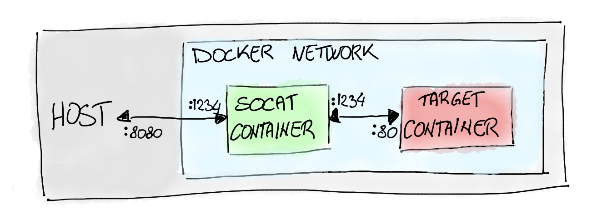

<!--BEGIN INTRO-->
You've just finally setup your Docker container and It’s up and running, but then when trying to access it from the host you realized that you didn't publish a port. Damn!

Well if it's not a problem you can just stop it and re-run it again by providing the `-p` flags you need and the problem is solved. But what if you ran some commands in the container since it started? You would need to repeat them again. Or what if you're in a situation where for some reason you cannot restart the container or you really don't want to?

In this post, I'm gonna show how different solutions could be applied depending on whether restarting the container is an option or not.

The version of Docker Engine I'm using in this post is the latest one at the time of writing that is `19.03`.
<!--END INTRO-->

## How port mapping works
Let's first have a look at how port mapping works first, feel free to skip this section if you're already familiar with the topic.

By default Docker containers are completely isolated from the host, this means that also the network is isolated. Thus if you want to run for example a Redis container you won’t be able to use it from the host unless you’ll explicitly instruct the container to publish the port (port number `6379` in this case) and map it to one available port on the host.

One important thing to keep in mind is to understand the difference between an **exposed** port and a **published** one.

A port can be exposed either using the `--expose` flag when running `docker run` or by using the `EXPOSE` command in a `Dockerfile`. Exposing a port actually does nothing with regard to networking and it should be interpreted as a way of documenting the ports used by the container. Indeed it's a good practice in a `Dockferfile` to show what are the ports that are used by the container by exposing them. [Here](https://github.com/docker-library/redis/blob/master/Dockerfile.template) you can see for example the `Dockerfile` for Redis that exposes port `6379`.

So if we run a container with Redis without mapping it to any port, we can see that we cannot reach it from the host even if in the `Dockerfile` it is marked as exposed. One thing to be noted is that a container’s port is not accessible by the host, but it is accessible by other containers running in the **same network**.

On the other hand, publishing a port maps that port on a container to another one on the host, and as you most probably know already this can be done using the `-p`. For example, we can either run Redis and map its port to the same one on the host or to another one:

```bash
# Mapping host port 6379 to container port 6379
$ docker run -d -p 6379:6379 redis
1dff53e256807c6bb61629976c20c85b386e112d2d57421293a42e4e9db44bd3

$ docker port 1dff53e256807c6bb61629976c20c85b386e112d2d57421293a42e4e9db44bd3
6379/tcp -> 0.0.0.0:6379

# Mapping host port 6380 to container port 6379
$ docker run -d -p 6380:6379 redis
fa57f5c1930aea2bf5cb81fd175db8e3775901d21e96ebdf1be20b8de86293d4

$ docker port fa57f5c1930aea2bf5cb81fd175db8e3775901d21e96ebdf1be20b8de86293d4
6379/tcp -> 0.0.0.0:6380
```

Now that we know the difference between exposing and publishing a port, it worths knowing that Docker provides a `-P` flag. This flag simply publishes all the ports that are exposed and map them to a set of random ones:

```bash
# Mapping random host ports to all the exposed ports (only 6379 for redis)
$ docker run -P -d redis
0881b92a9c2e235e3c6bed49fa349cb949f2d7b2f3c1657db814eaeaaa89e61f

$ docker port 0881b92a9c2e235e3c6bed49fa349cb949f2d7b2f3c1657db814eaeaaa89e61f
6379/tcp -> 0.0.0.0:32770
```

In this case, for example, the container's port `6739` has been mapped to the host's port `32770`.

## When restarting the container is fine
If restarting the container is fine, then you have two possible scenarios:

1. losing the changes applied in the container is fine,
2. losing the changes applied in the container is not fine at all.

Well, the first case is a no brainer and you most probably didn't land into this post if that's the case. You'll just need to stop the container and run it again by providing the proper `-p` flag to map a local port to the target port of the container.

### Committing the container
It could be the case that from the time you ran the container you already executed many commands and the idea of restarting the container and repeating them gives you the creeps. 😱

In this case, you can first `commit` the container so that the current state is saved into a new image:

```bash
$ docker commit <target container name or id> <name to give to the image>
```

Now you can just run a new container from the newly created image and provide the proper `-p` flag to map the port. You can now feel relieved again! 😌

## Without restarting the container
As you may have guessed already, it's not possible to map a port on a running container and this is also mentioned in [this ticket](https://github.com/docker/docker.github.io/issues/4942):

However, all is not lost! There's a tool named `socat` that makes it possible to access an unpublished port of a running container.

### What is `socat`?
`socat` is a tool that establishes two bidirectional byte streams and transfers data between them and we'll see how we can leverage this mechanism to access an unpublished port of a running container.

`socat` has a very wide set of use cases, and I’d highly suggest you to have a look at its [documentation page](https://linux.die.net/man/1/socat) if you’re interested in knowing more.

The basic idea of `socat` is that it takes two **addresses** parameters and it links them so that what’s read in the first is written in the second and vice versa.

It is actually possible to change this default behavior such as read/write in one direction only, or even make the second address to write back to a third address, but this is out of the scope of this brief intro.

`socat` is very flexible and in this context, an address can be many different things such as a TCP connection, a UDP one, a file descriptor, a Unix socket, etc..

For example, we can use `socat` to listen from a TCP connection and write to `stdout`:

```bash
$ socat TCP-LISTEN:1234 STDOUT
```

or vice versa write to `stdin` and send the bytes to a TCP connection:

```bash
$ socat STDIN TCP-CONNECT:localhost:5000
```

Each address can optionally have different options attached and different addresses types have different options available. See the documentation to see the full list.

At this point, you probably guessed already that we’re going to use `socat` to forward the traffic from the host to the unmapped port of the target container. Let’s see how in the next section.

### Using `socat` for forwarding the traffic
Let's say that your target container is running a web-server at port `80` and this is the unpublished port you wanna reach. We can run `socat` inside another container in the same network of the target one. By doing this we can instruct it to act as a proxy and to forward the traffic from a port of our choice that needs to be exposed, let's say `8080`, to the port `80` of the target container that is accessible since it runs in the same network through another port of our choice in the `socat` container, let's say `1234`.

Wait! What?! 🤯

It’s actually much easier than it sounds! And an image worths a thousand words!

<div class="row justify-content-center mb-3">
    <div class="col-12">
        
    </div>
</div>

Luckily for us, we don't even need to create a `Dockerfile`, but we can just use the `alpine/socat` image and run it with the correct command.

So let's create our target container that in this example will correspond to a very simple NGINX web-server that simply returns a plain text response when the root endpoint is `curl`ed:

```bash
$ docker run --name web-server -d nginxdemos/hello:plain-text
e6b0443cc363b3422507dd3980813cec181d4410c7cf9620bb9fd2f2abc17e38

$ docker ps
CONTAINER ID        IMAGE                                   COMMAND                  CREATED             STATUS              PORTS                                NAMES
e6b0443cc363        nginxdemos/hello:plain-text             "nginx -g 'daemon of…"   37 seconds ago      Up 36 seconds       80/tcp                               web-server
```

As we can see, the container is listening at port `80`, but we didn't map it to any port. In order to forward the traffic, the `socat` container needs to know the IP address of the target container:

```bash
$ docker inspect web-server -f "{{json .NetworkSettings.Networks }}" | jq
{
  "bridge": {
    "IPAMConfig": null,
    "Links": null,
    "Aliases": null,
    "NetworkID": "e6c2f9e58aebbd16e9dd71a0222022e51d54d471213923871e3c48ff6d57e878",
    "EndpointID": "d7a7ee059e82f241aa378c477472d166d556b0debb4f82272a6342d173070614",
    "Gateway": "172.17.0.1",
    "IPAddress": "172.17.0.3",
    "IPPrefixLen": 16,
    "IPv6Gateway": "",
    "GlobalIPv6Address": "",
    "GlobalIPv6PrefixLen": 0,
    "MacAddress": "02:42:ac:11:00:03",
    "DriverOpts": null
  }
}
```

> `jq` is a simple and powerful command-line utility useful to deal with `json`s from the command-line. If you don't have it just remove it from the command above.

As we can see the container is running at the address `172.17.0.3`. Let's then finally run our `socat` container with the command below:

```bash
$ docker run -d --name port-mapper -p 8080:1234 alpine/socat TCP-LISTEN:1234,fork TCP-CONNECT:172.17.0.3:80
```

Now we can `curl` port `8080` and the request will be forwarded to the port `80` of the target container as we wanted:

```bash
$ curl localhost:8080
Server address: 172.17.0.3:80
Server name: e6b0443cc363
Date: 23/Jun/2020:17:43:08 +0000
URI: /
Request ID: 12201ef25f22fc60d2abb64c1df83355
```

Yeah! We made it! 🎉

However, as I anticipated, this works because both containers are running in the same network. In this example they're both running in the default `bridge` network:

```bash
$ docker inspect web-server  -f "{{json .NetworkSettings.Networks }}" | jq
{
  "bridge": {
    "IPAMConfig": null,
    "Links": null,
    "Aliases": null,
    "NetworkID": "e6c2f9e58aebbd16e9dd71a0222022e51d54d471213923871e3c48ff6d57e878",
    "EndpointID": "d7a7ee059e82f241aa378c477472d166d556b0debb4f82272a6342d173070614",
    "Gateway": "172.17.0.1",
    "IPAddress": "172.17.0.3",
    "IPPrefixLen": 16,
    "IPv6Gateway": "",
    "GlobalIPv6Address": "",
    "GlobalIPv6PrefixLen": 0,
    "MacAddress": "02:42:ac:11:00:03",
    "DriverOpts": null
  }
}

$ docker inspect port-mapper  -f "{{json .NetworkSettings.Networks }}" | jq
{
  "bridge": {
    "IPAMConfig": null,
    "Links": null,
    "Aliases": null,
    "NetworkID": "e6c2f9e58aebbd16e9dd71a0222022e51d54d471213923871e3c48ff6d57e878",
    "EndpointID": "b796a4a37b984bd9cdb5fa9689c812c7f3f5813f78ec8e81c8b28d9eeb3f7f10",
    "Gateway": "172.17.0.1",
    "IPAddress": "172.17.0.4",
    "IPPrefixLen": 16,
    "IPv6Gateway": "",
    "GlobalIPv6Address": "",
    "GlobalIPv6PrefixLen": 0,
    "MacAddress": "02:42:ac:11:00:04",
    "DriverOpts": null
  }
}
```

If for example, the target container is running on a user-defined network, then we need to make the `socat` container run in the same one. Otherwise, the `curl` will just hang and eventually timeout.

Let's see this in practice by creating a network and making our target web-server container run in it:

```bash
$ docker network create sample-network
0e83efadb92a179910e8e32b0554575ffe1fe9d57388c9e79d38103618ee6ba4

$ docker run --name web-server-in-sample-net --network sample-network -d nginxdemos/hello:plain-text
a84a1c93e6319bb7662faa3474bca971c4077e48f0d262076afeba1520bd83b0
```

In this case, we know that our target container is running in the network called `sample-network` since we created it. In case you don't you can always inspect the container and retrieve it with the same command mentioned above:

```bash
$ docker inspect web-server-in-sample-net  -f "{{json .NetworkSettings.Networks }}" | jq
{
  "sample-network": {
    "IPAMConfig": null,
    "Links": null,
    "Aliases": [
      "a84a1c93e631"
    ],
    "NetworkID": "0e83efadb92a179910e8e32b0554575ffe1fe9d57388c9e79d38103618ee6ba4",
    "EndpointID": "4278e04507fa4f80b64df12bb42617b693aa268004e8348cd3f32296ba32704a",
    "Gateway": "172.26.0.1",
    "IPAddress": "172.26.0.2",
    "IPPrefixLen": 16,
    "IPv6Gateway": "",
    "GlobalIPv6Address": "",
    "GlobalIPv6PrefixLen": 0,
    "MacAddress": "02:42:ac:1a:00:02",
    "DriverOpts": null
  }
}
```

As you can see it returns a JSON with a key that corresponds to the network name.

Let's then create again our `socat` container, but this time by passing it the correct network to connect to:

```bash
$ docker run -d --name port-mapper-in-sample-net --network sample-network -p 8080:1234 alpine/socat TCP-LISTEN:1234,fork TCP-CONNECT:172.26.0.2:80
```

We're now able again to `curl` the target container as shown before! 🎉

You can verify that `curl` won't work if you don't provide the `--network sample-network` flag to the port mapper.

## Conclusions
After reviewing the difference between exposing and publishing a port we went through the different ways we could access an unpublished port depending on the needs.  There are many different use cases where accessing an unpublished port is needed and I hope that you were able to solve yours and that you found `socat` an interesting tool to study further.

One scenario I didn’t cover in this post is how to achieve the same if the docker container is part of a docker-compose setup. But you could give it a try yourself as you should be able to easily address it by applying the same concepts outlined here.

If you found this post interesting then please share it with your friends or in your socials!

## References
- [https://docs.docker.com/config/containers/container-networking/](https://docs.docker.com/config/containers/container-networking/)
- [https://github.com/docker/docker.github.io/issues/4942](https://github.com/docker/docker.github.io/issues/4942)
- [https://hub.docker.com/r/alpine/socat/](https://hub.docker.com/r/alpine/socat/)
- [https://hub.docker.com/r/nginxdemos/](https://hub.docker.com/r/nginxdemos/hello)
- [https://linux.die.net/man/1/socat](https://linux.die.net/man/1/socat)
- [https://medium.com/@copyconstruct/socat-29453e9fc8a6](https://medium.com/@copyconstruct/socat-29453e9fc8a6)
- [https://nickjanetakis.com/blog/docker-tip-59-difference-between-exposing-and-publishing-ports](https://nickjanetakis.com/blog/docker-tip-59-difference-between-exposing-and-publishing-ports)
- [https://www.ctl.io/developers/blog/post/docker-networking-rules](https://www.ctl.io/developers/blog/post/docker-networking-rules)
- [https://stackoverflow.com/questions/19897743/exposing-a-port-on-a-live-docker-container](https://stackoverflow.com/questions/19897743/exposing-a-port-on-a-live-docker-container)
- [https://stackoverflow.com/questions/22111060/what-is-the-difference-between-expose-and-publish-in-docker](https://stackoverflow.com/questions/22111060/what-is-the-difference-between-expose-and-publish-in-docker)
