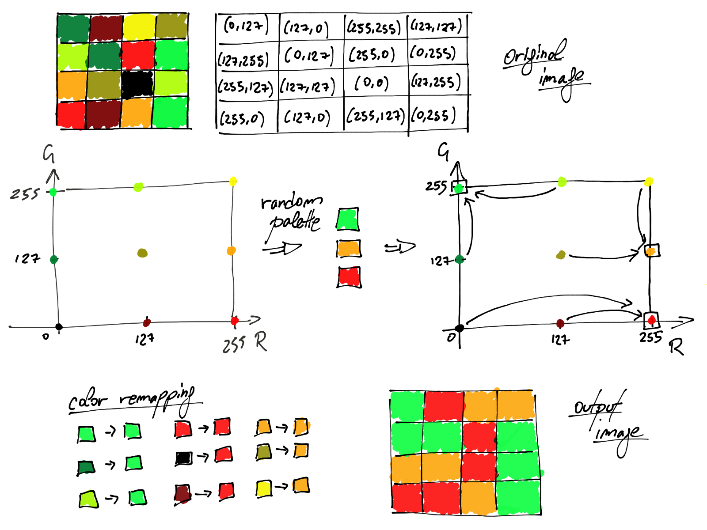

<!--BEGIN INTRO-->
In this article, I'd like to talk about color quantization and how the k-means clustering algorithm can be used to perform it and how it performs compared to simpler methods. The snippets presented here are written in Python and come from this [project](https://github.com/se7entyse7en/image-quantizer).
<!--END INTRO-->

## What is color quantization?

**Color quantization** is the process of reducing the number of distinct colors used in an image. The main reason we may want to perform this kind of compression is to enable the rendering of an image in devices supporting only a limited number of colors (usually due to memory limitations).

Obviously, all compressions come with a cost. In this case, the resulting image may differ too much from the original one. Hence the goal of the color quantization is to obtain a compressed image *as similar as possible* to the original one. The key factor for achieving this is the selection of the **color palette** by choosing the colors that most *summarizes* the original image.

The most common techniques reduce the problem of color quantization into a **clustering problem** of points where each point represents the color of a pixel. It consists of creating the palette by selecting a representative point for each cluster. After that, the compression simply remaps all the colors into their cluster representative. As you may guess the resulting palette highly depends on the color space and distance metric used.

Before digging into the palette selection in more detail here's a simple and brief introduction about color spaces and color difference. The idea is to give a grasp on some concepts that are necessary to understand what comes next without being too much detailed as a more detailed explanation is out of the scope of this post. Feel free to skip these parts if you already know what they're talking about.

## Color spaces and color difference

As previously anticipated a color can be represented as a point in an n-dimensional space called **color space**. Most commonly the space is 3-dimensional and the coordinates in that space can be used to encode a color.

There are many color spaces for different purposes and with different *gamut* (range of colors), and in each of them, it is possible to define a distance metric that quantifies the **color difference**. The most common and easiest distance metric used is the *Euclidean distance* which is used in RGB and Lab color spaces.

### RGB color space

The **RGB** (abbreviation of red-green-blue) color space is by far the most common and used color space. The idea is that it is possible to create colors by combining red, green and blue. A color in RGB is usually encoded as a 3-tuple of 8 bits each, hence each dimension takes a value within the range $[0, 255]$ where $0$ stands for the absence of color while $255$ stands for *full presence* of color.

$$
d = \sqrt{(R_1 - R_2)^2 + (G_1 - G_2)^2 + (B_1 - B_2)^2}
$$

One caveat of using the Euclidean distance in the RGB color space is that it isn't uniform with the difference perceived by the eye. In other words, two pairs of colors might be perceived as not equally different even if they have the same Euclidean distance. If we denote with $d'$ the perceived difference and we calculate the difference between the pairs of colors $(R_1,G_1,B_1)$, $(R_2,G_2,B_2)$ and $(R_1,G_1,B_1)$, $(R_3,G_3,B_3)$ we might have:

$$
d((R_1,G_1,B_1),(R_2,G_2,B_2)) = d((R_1,G_1,B_1),(R_3,G_3,B_3)) \\
d'((R_1,G_1,B_1),(R_2,G_2,B_2)) \neq d'((R_1,G_1,B_1),(R_3,G_3,B_3))
$$

This is due to the fact that the human eye is more sensitive to certain colors than others.

### Lab color space

The **Lab** color space, more formally $L^*a^*b^*$, includes all perceivable colors meaning that its gamut is a superset of the gamut of the RGB color space, and has the intent of being perceptually uniform and hence to solve the problem that affects the RGB color space when using the Euclidean distance. In the case of Lab this distance is known as CIE76 and it is denoted with $\Delta E^*_{76}$ (CIE stands for *International Commission on Illumination*):

$$
\Delta E^*_{76} = \sqrt{(L^*_1 - L^*_2)^2 + (a^*_1 - a^*_2)^2 + (b^*_1 - b^*_2)^2}
$$

The $L^*$ dimension represents the lightness of the color and its value is in $[0, 100]$ where the higher the lighter. $a^*$ and $b^*$ are color-opponent dimensions where $a^*$ represents green at negative values and red at positive ones, while $b^*$ represent blue at negative values and yellow at positive ones. For both $a^*$ and $b^*$ the value of $0$ represents a neutral gray and their range depends on the Lab implementation, but it is usually $[-100, 100]$ or $[-128, 127]$.

### Other color spaces

There are many other color spaces and even if they're not going to be used in the next sections to perform color quantization, it worth mentioning the $L^*C^*h^*$ color space that has been introduced in order to fix some problems that occur when using $\Delta E^*_{76}$. For this reason, the CIE defined the $\Delta E^*_{94}$ and then the $\Delta E^*_{00}$ both defined in the $L^*C^*h^*$ color space. Anyway, both distances are not based on the simple Euclidean distance.

## Palette selection

We can now start performing color quantization and see how the output changes depending on the color space used, the method adopted to create the palette, and the size of the palette we want to build.

To compare the different cases we're going to use the image of [Lenna](https://medium.com/r/?url=https%3A%2F%2Fen.wikipedia.org%2Fwiki%2FLenna):

<div class="row justify-content-center mb-3">
    <div class="col-12 col-sm-6">
        
    </div>
</div>


### Random selection

The easiest method to select the colors that will be part of the palette is to choose them completely random. After having built the palette each color is remapped to the nearest color that is part of that selection. As you may guess using RGB or Lab space doesn't make any difference and the only thing that affects the final output is the number of colors to use. If with this selection strategy it seems that one color space seems to behave better than the other one, keep in mind that given the randomness of the selection it can be just a case.

In the following figure, it's visually explained the whole process in case of RGB space where the final palette is composed of three colors (for Lab space is completely analogous). For simplicity in this example, the blue channel is fixed to the value of $0$, hence we can consider only the $R$ and the $G$ dimensions. All the pixels of the image are represented with the RGB encoding and then mapped into the RGB space. Then 3 random colors are selected to be part of the palette. Finally, all the colors are remapped to the nearest selected color according to the Euclidean distance.

<div class="row justify-content-center mb-3">
    <div class="col-12">
        
    </div>
</div>

#### Using random selection in RGB space

Here there are the output images generated by randomly selecting the colors in RGB color space. Their palettes are composed by $8$, $16$, $32$ and $64$ colors respectively.

<div class="row justify-content-center mb-3">
    <div class="col-12 col-sm-3 mt-1 mt-sm-0">
        
    </div>
    <div class="col-12 col-sm-3 mt-1 mt-sm-0">
        
    </div>
    <div class="col-12 col-sm-3 mt-1 mt-sm-0">
        
    </div>
    <div class="col-12 col-sm-3 mt-1 mt-sm-0">
        
    </div>
</div>


#### Using random selection in Lab space

Here instead there are the output images generated by randomly selecting the colors in Lab color space. Also, in this case, their palettes are composed by $8$, $16$, $32$ and $64$ colors respectively.

<div class="row justify-content-center mb-3">
    <div class="col-12 col-sm-3 mt-1 mt-sm-0">
        
    </div>
    <div class="col-12 col-sm-3 mt-1 mt-sm-0">
        
    </div>
    <div class="col-12 col-sm-3 mt-1 mt-sm-0">
        
    </div>
    <div class="col-12 col-sm-3 mt-1 mt-sm-0">
        
    </div>
</div>

#### The code

The implementation of the color quantization via random palette selection is very easy. In the following snippet both the input variable `raster` and the output variable `quantized_raster` are `numpy.ndarray`s which correspond to the raster of the original image and the raster of the quantized image. They can be both be encoded with RGB or Lab (the output raster has the same encoding of the input) and have shape `(width, height, 3)`.

```python
import numpy as np

from sklearn.metrics import pairwise_distances_argmin
from sklearn.utils import shuffle

def quantize(raster, n_colors):
    width, height, depth = raster.shape
    reshaped_raster = np.reshape(
        raster, (width * height, depth))

    palette = shuffle(reshaped_raster)[:n_colors]
    labels = pairwise_distances_argmin(
        reshaped_raster, palette)

    quantized_raster = np.reshape(
        palette[labels], (width, height, palette.shape[1]))

    return quantized_raster
```

The raster of an image can be retrieved by passing the path of the file to `scipy`:

```python
import scipy.misc

raster = scipy.misc.imread(image_filename)
```

The output of `scipy.misc.imread` is a `numpy.ndarray` with shape `(width, height, 3)` and values RGB encoded. Hence in order to perform the quantization in Lab space we first need to convert RGB to Lab. Thanks to `skimage` it is possible to convert from RGB to Lab and vice-versa:

```python
from skimage import color

lab_raster = color.rgb2lab(rgb_raster)
rgb_raster = color.lab2rgb(lab_raster) * 255).astype('uint8')
```

Finally, to visualize the result of the color quantization we can use `matplotlib`:

```python
import matplotlib.pyplot as plt

plt.imshow(rgb_raster / 255.0)
plt.draw()
plt.show()
```

Note that the `imshow` function works only with RGB values normalized in the $[0, 1]$ interval, that's why we need to divide by $255$.

### Selection with k-means

As anticipated at the beginning of the post, one common approach to perform color quantization is to use a clustering algorithm. In this case, we're going to use **k-means** that minimizes the within-cluster sum of squared distances between the centroid and the other points of the cluster. Given that the distance used by the k-means clustering algorithm is the Euclidean distance, it is a natural fit for being applied for color quantization with both RGB and Lab space. For the purpose of this post, I'm going to assume that you know how k-means works.

The procedure consists of applying the k-means algorithm with a number of centroids that is equal to the number of colors we want the palette to be composed of. Then we use the resulting centroids as the colors that will be part of the palette. After that, each color is remapped to the nearest one among those in the palette as in the random selection. Given the nature of k-means, the nearest color corresponds exactly to the centroid representing the cluster the color is part of.

It is important to notice that $n$ pixels of an image having the same color consist of $n$ overlapping points in the color space and not in a single point. Actually, in case of random selection, it makes no difference, but it does a lot of difference when applying the k-means algorithm.

Remember that the Euclidean distance in Lab space is uniform with the difference perceived by the eye. Hence with this kind of selection, we can expect that using the Lab space should have a visually better result than RGB.
Similarly to the other figure in the following one, it's visually explained the whole process in case of RGB space, but using the k-means algorithm. Even in this example, the final palette is composed of three colors and the blue channel is fixed to the value of $0$ for simplicity. All the pixels of the image are represented with the RGB encoding and then mapped into the RGB space as in the case of the random selection. Then the k-means algorithm is applied and the centroids of the cluster are selected to be part of the palette. Finally, as in the random palette selection, all the colors are remapped to the nearest selected color according to the Euclidean distance.

<div class="row justify-content-center mb-3">
    <div class="col-12">
        
    </div>
</div>

#### Using k-means selection in RGB space

Here there are the output images generated using k-means in RGB color space. Their palettes are composed by $8$, $16$, $32$ and $64$ colors respectively.

<div class="row justify-content-center mb-3">
    <div class="col-12 col-sm-3 mt-1 mt-sm-0">
        
    </div>
    <div class="col-12 col-sm-3 mt-1 mt-sm-0">
        
    </div>
    <div class="col-12 col-sm-3 mt-1 mt-sm-0">
        
    </div>
    <div class="col-12 col-sm-3 mt-1 mt-sm-0">
        
    </div>
</div>


#### Using k-means selection in Lab space

Here instead there are the output images generated using k-means in Lab color space. Also, in this case, their palettes are composed by $8$, $16$, $32$ and $64$ colors respectively.

<div class="row justify-content-center mb-3">
    <div class="col-12 col-sm-3 mt-1 mt-sm-0">
        
    </div>
    <div class="col-12 col-sm-3 mt-1 mt-sm-0">
        
    </div>
    <div class="col-12 col-sm-3 mt-1 mt-sm-0">
        
    </div>
    <div class="col-12 col-sm-3 mt-1 mt-sm-0">
        
    </div>
</div>

#### The code

Here's the code to perform the color quantization through k-means. The following function has the same signature of the one used for random selection, and what has been already discussed regarding raster loading, color space conversion, and result visualization still applies.

```python
import numpy as np

from sklearn import cluster

def quantize(raster, n_colors):
    width, height, depth = raster.shape
    reshaped_raster = np.reshape(raster, (width * height, depth))

    model = cluster.KMeans(n_clusters=n_colors)
    labels = model.fit_predict(reshaped_raster)
    palette = model.cluster_centers_

    quantized_raster = np.reshape(palette[labels], (width, height, palette.shape[1]))

    return quantized_raster
```

## Conclusions

We can visibly notice that the usage of k-means outperforms the usage of simple random selection. In fact, the images obtained with random selection with $64$ colors are very similar to those obtained with k-means with $32$ colors independently from the color space used. The drawback of using k-means is that it is obviously much slower especially if the training is performed with all the pixels of the original image. This can be mitigated by using only a random sample of the pixels.

On the other hand at first glance the results of k-means in RGB space and k-means in Lab space are similar. Anyway, by taking a closer look at each couple of images, in some cases, it is possible to notice some details that make us say that one is better than the other. In general, for this particular image, the face seems to be clearer and more defined when using RGB and this can be noticed especially in the first two couple of images. However using Lab space seems to render the reflection in the mirror and the hat better, and it also recalls the brightness of the original image. Overall I wouldn't say that when using k-means a color space is a better choice than the other, at least not for this particular image.
