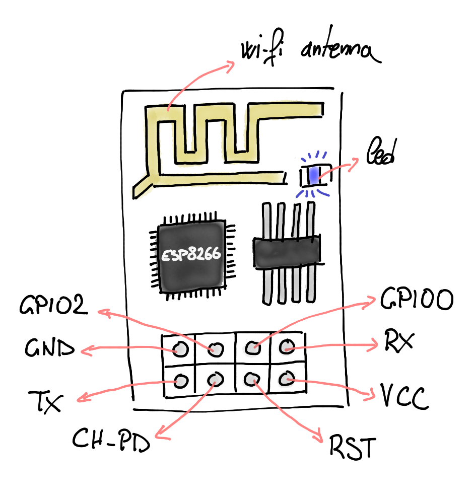
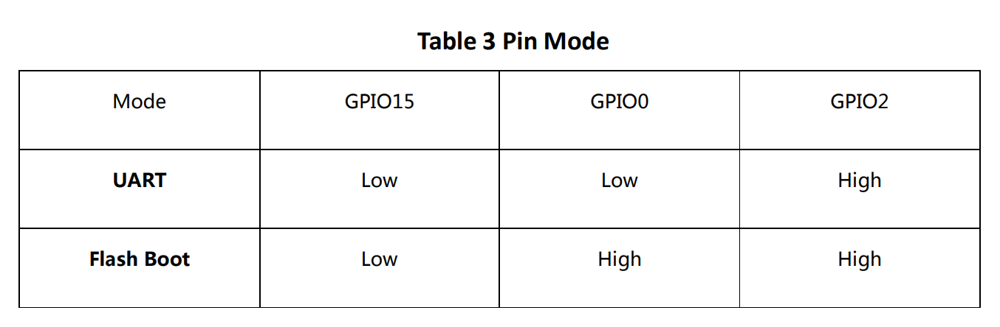
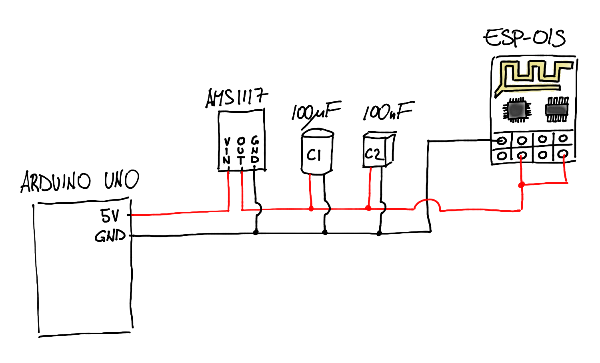
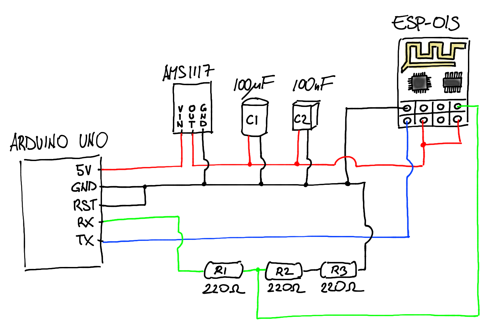
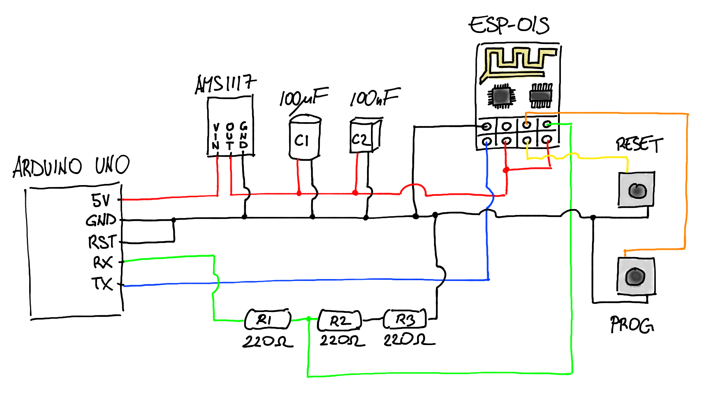

<!--BEGIN INTRO-->
The ESP-01S is a board that provides WiFi connectivity to the Arduino, but that can also be used stand-alone for small projects.

The ESP-01S itself doesn’t provide a UART (serial) to USB converter built-in to be as much compact as possible, but this means that in order to upload a sketch into it, we need to build a temporary circuit.

There are different alternatives out there called “programmer” that indeed are devices you can connect to the USB and onto which you can attach the ESP-01S itself.

In this blog post, I’m not gonna use any of those, but I’m showing how to do it with an Arduino UNO and some extra circuitry.
<!--END INTRO-->

## ESP-01S pinout and boot modes
The ESP-01S exposes 8 pins:
1. `GND` - ground,
2. `TXD` - write data,
3. `GPIO2` - general purpose IO,
4. `CH_EN` - to enable the chip,
5. `GPIO0` - general purpose IO, (but has a special functionality we’ll see in a few),
6. `RESET` - to reboot the chip,
7. `RXD` - read data,
8. `VCC` - to power the chip.

You can see them in the following drawing.

    

        
    

Here’s the link to the datasheet of the ESP-01S: http://www.microchip.ua/wireless/esp01.pdf.

Among all the information that are available in the datasheet, the things that we need to consider for our purpose are:
- how to power the ESP-01S (voltage and current requirements),
- how to connect the pins for writing (TXD) and reading (RXD),
- how to boot the ESP-01S in serial programming mode to upload the sketch.

We’ll go into each of these topics in the next sections.

As described in the datasheet, the ESP-01S can boot in UART mode or in Flash Boot mode depending on 3 pins:
- `GPIO15` (LOW by default),
- `GPIO0` (HIGH by default),
- `GPIO2` (HIGH by default).

Here's a screen from the datasheet.

    

        
    

By looking at the defaults, it’s easy to notice that the default boot mode is Flash boot. This means that it loads the code that is stored in the flash memory. When we want to upload a sketch, we’ll basically overwrite what’s inside the flash memory. In order to do so we need to enter into UART mode which means booting the ESP-01S with the `GPIO0` pin grounded.

### ESP-01 vs ESP-01S vs ESP-8266
When initially looking online, I was very confused about the difference between the ESP-01, the ESP-01S and the ESP-8266, hence I’d like to also shed some light on this topic.

Both the ESP-01 and the ESP-01S are miniature development board that have a ESP-8266 microchip installed. The ESP-8266 microchip is what provides the Wi-Fi functionality. The main difference between the two development board, is the flash memory that is 512KB for the ESP-01 and 1MB for the ESP-01S.

In this post I’ll focus on the ESP-01S, but everything should be applicable to the ESP-01 as well since the differences are minimal and the pinout is the same. Other than the flash memory, the only other differences that you should find are:
- in the ESP-01 there are two leds, a red one for power and a blue one for Wi-Fi, while on the ESP-01S there’s only the blue led,
- the ESP-01 board can be found both blue and black.

// TODO: Add pictures of both ESP-01 and ESP-01S

## Powering the ESP-01
As described in the datasheet, the ESP-01S works at 3.3V, but the current required it’s greater than the one provided by the 3.3V pin of the Arduino UNO. On the other hand, the current provided by the 5V pin is enough, but this requires a to regulate the voltage from 5V to 3.3V in order to avoid damaging the ESP-01S module.

In order to level down from 5V to 3.3V there are different options. An easy alternative is to use 2 diodes in series. The voltage drop of a diode is around 0.6/0.7V, so adding them in series would result into a resulting voltage of ~3.6/3.8 which is fine. The problem with the diodes is that the voltage drop is not constant but depends on current drawn.

Another way to level down the voltage is by using a voltage divider, but it’s not the best solution for supplying power, but we’ll use this mechanism later for connecting the data pins.

I ended up using a voltage regulator AMS1117 that levels down from 5V to 3.3V.

Another thing that we can notice is that the current drawn by the ESP-01S varies from X to Y. In order to stabilize the current, we can add some decoupling capacitors: a 100uF one and a 100nF one in parallel to the ESP-01S.

    

        
    

// TODO: Add screen of the schematic of this part

## Communicating with the ESP-01S
As said before, the ESP-01S doesn’t provide a USB to Serial adapter, that’s why we’re going to use the one provided by the Arduino UNO. Basically we’re going to use the Arduino UNO as a bridge to “speak” directly with the ESP-01S. In order to do so we need to do the followings:
- Make the RST pin of the Arduino UNO go to GND,
- Connect the RX of the uno to the RXD of the ESP-01S, and the same for TX and TXD.

Now we need to do a few considerations. The fact that the ESP-01S works at 3.3v affects also the data pins. Reading the data from the ESP-01S from RX is not a problem because the ESP-01S outputs 3.3V as HIGH which is considered as HIGH also by the UNO. Even if in theory a voltage level up is better, we can live with it.

On the other hand, writing to the ESP01S has the same problem we approached during the powering up section. That is the HIGH is 5V, so we need to scale down the voltage.

In order to do so (can use again the voltage regulator?) we can use a voltage divider. In this case I used 220ohm for R1 and 2x220omh for R2.

    

        
    

// TODO: Add screen of the schematic of this part

## Buttons for RST and GPIO0
Since in order to boot the ESP-01S in UART mode we need to ground `GPIO0`, we’ll add two push-buttons to make this handier. The first button is for the `RST` pin, and the second one is for the `GPIO0` pin, and both of them when pushed will ground the corresponding pins. I’m going to call these buttons `RESET` and `PROG` respectively.

To enter in UART mode we’ll need to do the following then:
1. press `RESET` and `PROG` at the same time,
2. release `RESET`,
3. release `PROG`.

// TODO: Add gif for the pressing sequence

## Final circuit
At this point we should have a circuit that should look as in the picture below:

// TODO: Add picture of the circuit on the breadboard

This is the schematic:

    

        
    

// TODO: Add screen of the full schematic

## Uploading a sketch
Now that we have the circuit ready, we can finally upload a sketch! We’ll use the Arduino IDE for that. You first need to install the XXX. Have a look here at how to install it:

// TODO:  Need to do specific links and download the board: [How to Program ESP8266 with Arduino UNO - Arduino Project Hub](https://create.arduino.cc/projecthub/harshmangukiya/how-to-program-esp8266-with-arduino-uno-efb05f)
	- [A Beginner’s Guide to the ESP8266](https://tttapa.github.io/ESP8266/Chap06%20-%20Uploading.html)

For those that are using OSX as I do, you may bump into this error: YYYY.

// TODO: properly explain how to troubleshoot the bug:  OS X issue when uploading: [PySerial and EspTools Directory Error](https://forum.arduino.cc/index.php?topic=702144.0)

Another very important thing to set which took me a while to realize is that we need to reduce the upload speed! The reason is because the voltage divider doesn’t support high baud rate, hence a high upload speed we’ll prevent the ESP-01S to be flashed.

We can start by uploading a blink sketch that blinks the build-in blue led of the ESP-01S. In the ESP-01S it can be done by sending `HIGH` to pin `2`.

// TODO: Add snipped of the code

You can now click upload, and when you see “connecting...” you’ll need to make the ESP-01S boot into flash mode as explained in the previous section. You now see in the logs of the IDE that it’s uploading the code. If it doesn’t work and it continues printing “connecting…” then it means that something went wrong.

// TODO: Add gif of the

After doing so, press RST to boot the ESP01 in Flash mode and here we go!  You can see see the led blinking!

// TODO: Add gif of the ESP-01S blinking

## Make the ESP-01S communicate with the Arduino UNO
For sure, despite being an accomplishment already, just making the led of the ESP blink it’s not that much useful.
There are plenty of articles out there explaining how to implement a webserver or do other interesting things. I’ll eventually explain how to implement a webserver in another post, but in this section I’d like to explain already how to make the Arduino UNO and the ESP communicate with each other.

So this means having two sketches, one in the ESP and one in the UNO. Toward establishing a communication, they need to use the Serial. I’m assuming that for debugging purposes we’d like to be able to use the Serial of the IDE, this means that we need to connect the RXD and TXD pins of the ESP-01S to different pins than RX and TX of the UNO.

The caveat here is that only the RX and TX pins of the UNO has support to serial in the hardware, for all the other pins it is simulated by using the Serial library. Since it is simulated, the maximum baud rate supported is lower, but this is fine since it cannot be too high in any case due to the voltage divider as has been described previously.

### Example: Ping-Pong
In this example, I’ll upload two very simple sketches just to show how the communication works. The program will work as follows:
1. The UNO will send “Ping” every second to the ESP-01S,
2. The ESP-01S will check every 0.2seconds and will send “Waiting” if nothing is available to read, “Pong” if “Ping” is read, and “Error” otherwise.

// TODO: Add the sketches
// TODO: Add the schematic
// TODO: Add a gif of the logs

## Bonus
### A better UART mode booter
As you may have realized, despite not being a big deal, the sequence of the buttons need to be pressed it’s not the best user experience. It would be better to just press the `PROG` button. What we want to achieve is that pressing the `PROG` button grounds both `GPIO0` and `RST`, then on release `GPIO0` stays grounded for some time. Luckily we can this with an RC circuit!

// TODO: Add brief explanation of what is an RC circuit

By using a resistor of X and a capacitor of Y we can delay the `OFF` by Z seconds and achieve the same sequence we were doing manually.

// TODO: Add the formula and the exact calculation with the exact values

In the end, the full schematic looks as follows:

// TODO: Add the full schematic

### Custom programmer PCB
In case you didn’t realize yet, we’ve just built a custom programmer for the ESP01S! So why don’t built a custom PCB as well?

I won’t go into the details but there are some great tutorials made by sparkfun on how to use Eagle to both built the schematic and the PCB. Everything is available on Github, but here’s the screenshot of the PCB design.

// TODO: Add picture of the PCB design with and without copper planes

Once designed, there are many manufacturers out there that can print the actual PCB starting from the design. Here’s a picture of the PCB that I designed when it arrived and I soldered the components:

// TODO: Add picture of the raw PCB
// TODO: Add picture of the soldered PCB

## References
- [ESP01. Get started with the Arduino or PlatformIO IDE. Which module to choose? Pinout • DIY Projects](https://diyprojects.io/esp01-get-started-arduino-platformio-ide-module-choose-pinout/#.YD3uw11Ki3I)
