In this post, I want to explore what is an image histogram, how it is useful to understand an image and how it can be calculated using [OpenCV](https://opencv.org/) which is *de facto* the standard tool for **computer vision**. In this post, I'm going to use OpenCV 3 with Python 3.6.

## What is an image histogram?

A **histogram** is a graph or a plot that represents the distribution of the pixel intensities in an image. In this post, we're going to focus on the RGB color space (see [here](color-quantization-using-k-means) if you want an explanation about the difference between some color spaces such as RGB and Lab), hence the intensity of a pixel is in the range $[0, 255]$. When plotting the histogram we have the pixel intensity in the X-axis and the frequency in the Y-axis. As with any other histogram, we can decide how many bins to use.

A histogram can be calculated both for the grayscale image and for the colored image. In the first case we have a single channel, hence a single histogram. In the second case we have three channels, hence three histograms.

Calculating the histogram of an image is very useful as it gives an intuition regarding some properties of the image such as the **tonal range**, the **contrast**, and the **brightness**.

## Calculating the histogram

Let's now see how we can calculate the histogram of any given image using OpenCV and display them using `matplotlib`.

OpenCV provides the function `cv2.calcHist` to calculate the histogram of an image. The signature is the following:

```python
cv2.calcHist(images, channels, mask, bins, ranges)
```

where:
1. `images` - is the image we want to calculate the histogram of wrapped as a list, so if our image is in variable `image` we will pass `[image]`,
2. `channels` - is the index of the channels to consider wrapped as a list (`[0]` for grayscale images as there's only one channel and `[0]`, `[1]` or `[2]` for color images, if we want to consider the channel blue, green or red respectively),
3. `mask` - is a mask to be applied on the image if we want to consider only a specific region (we're gonna ignore this in this post),
4. `bins` - is a list containing the number of bins to use for each channel,
5. `ranges` - is the range of the possible pixel values which is $[0, 256]$ in case of RGB color space (where $256$ is not inclusive).

The returned value `hist` is a `numpy.ndarray` with shape `(n_bins, 1)` where `hist[i][0]` is the number of pixels having an intensity value in the range of the i-th bin.

We can simplify this interface by wrapping it with a function that in addition to calculate the histogram it also draws it (at the moment we're going to fix the number of bins to $256$):

```python
import cv2 from matplotlib
import pyplot as plt

def draw_image_histogram(image, channels, color='k'):
    hist = cv2.calcHist([image], channels, None, [256], [0, 256])
    plt.plot(hist, color=color)
    plt.xlim([0, 256])
```

where image can be loaded using `cv2.imread('path/to/image')`.

Let's now see the histograms of these three sample images:

<div class="row justify-content-center mb-3">
    <div class="col-12 col-sm-4 mt-1 mt-sm-0">
        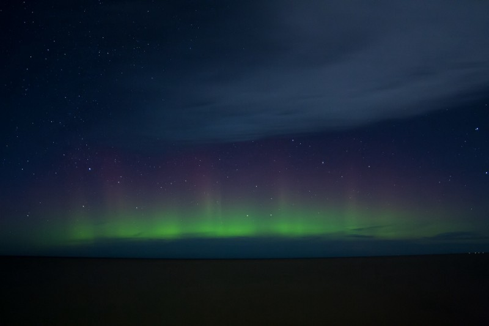
    </div>
    <div class="col-12 col-sm-4 mt-1 mt-sm-0">
        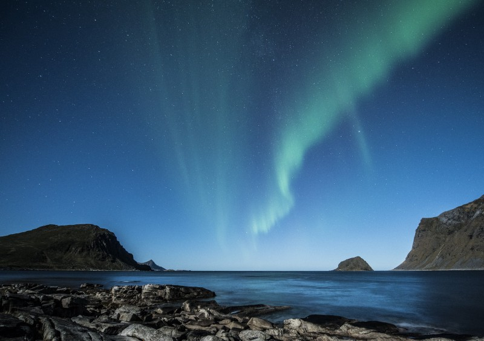
    </div>
    <div class="col-12 col-sm-4 mt-1 mt-sm-0">
        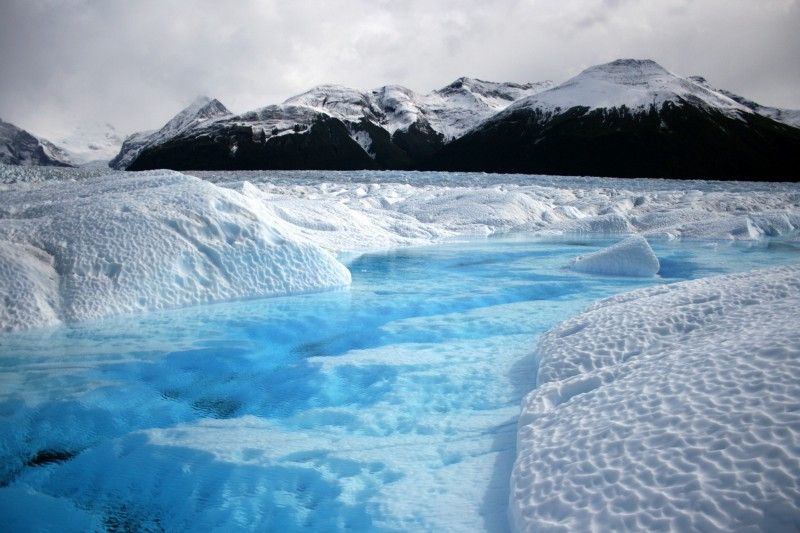
    </div>
</div>

### Grayscale histogram

Let's start by considering the histogram of the grayscale version of the above sample images. We can write the following helper function to display using `matplotlib` the histogram of the grayscale version of an image:

```python
import cv2 from matplotlib
import pyplot as plt

def show_grayscale_histogram(image):
    grayscale_image = cv2.cvtColor(image, cv2.COLOR_BGR2GRAY)
    draw_image_histogram(grayscale_image, [0])
    plt.show()
```

If we execute this function for the sample images we obtain the following histograms:

<div class="row justify-content-center mb-3">
    <div class="col-12 col-sm-4 mt-1 mt-sm-0">
        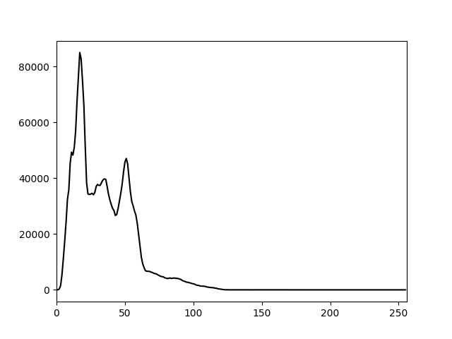
    </div>
    <div class="col-12 col-sm-4 mt-1 mt-sm-0">
        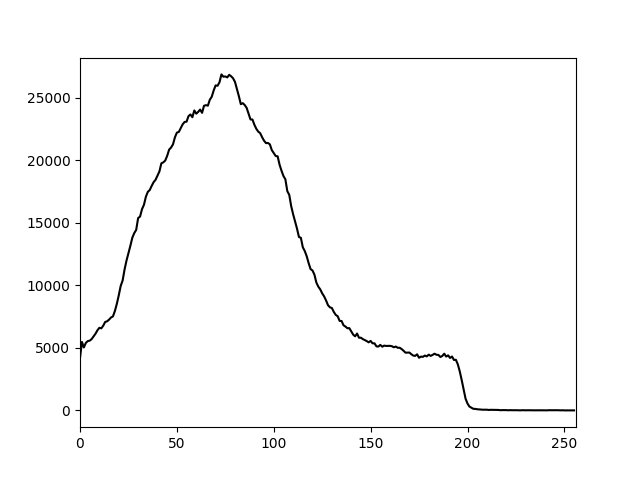
    </div>
    <div class="col-12 col-sm-4 mt-1 mt-sm-0">
        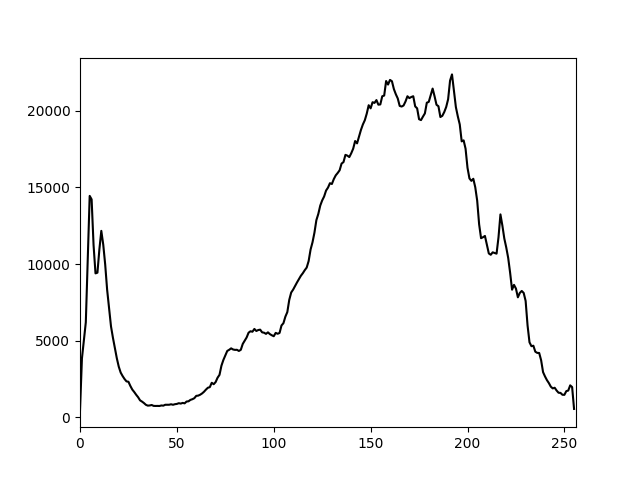
    </div>
</div>

Let's now analyze these plots and see what kind of information we can extract from them. From the first one, we can infer that all the pixels of the corresponding image have a low intensity as their almost all in the $[0, 60]$ range approximately. From the second one, we can see that the distribution of the pixel intensities is still more skewed over the darker side as the median value is around $80$, but the variance is much larger. Then from the last one, we can infer that the corresponding image is much lighter overall but also have some dark regions.

I think that even if the histograms weren't given in the same order of the sample images, anyone could be able to guess which histogram belongs to each image by simply doing the above analysis.

Here are the grayscale images with the corresponding histograms:

<div class="row justify-content-center mb-3">
    <div class="col-12">
        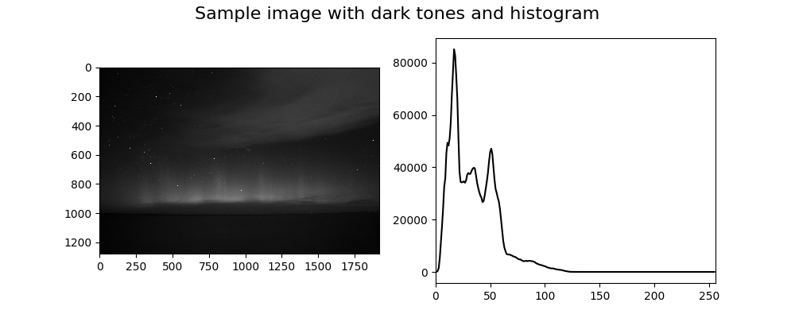
    </div>
</div>

<div class="row justify-content-center mb-3">
    <div class="col-12">
        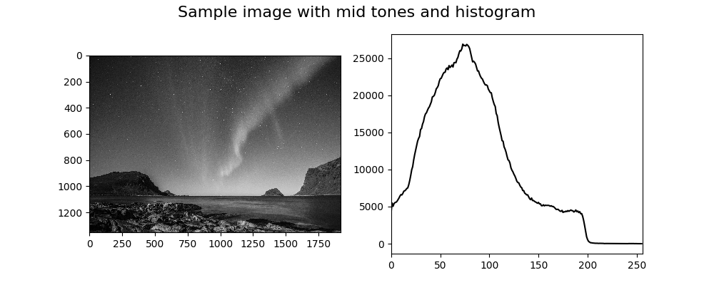
    </div>
</div>

<div class="row justify-content-center mb-3">
    <div class="col-12">
        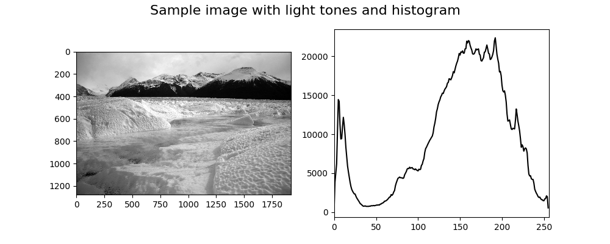
    </div>
</div>

### Color histogram

Let's now move onto the histograms of the colored sample images. Even in this case, we can write the following helper function to display using `matplotlib` the histogram an image:

```python
import cv2
from matplotlib import pyplot as plt

def show_color_histogram(image):
    for i, col in enumerate(['b', 'g', 'r']):
        draw_image_histogram(image, [i], color=col)
    plt.show()
```

If we execute this function for the sample images we obtain the following histograms:

<div class="row justify-content-center mb-3">
    <div class="col-12 col-sm-4 mt-1 mt-sm-0">
        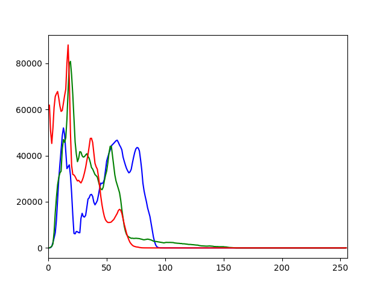
    </div>
    <div class="col-12 col-sm-4 mt-1 mt-sm-0">
        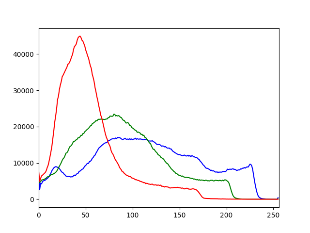
    </div>
    <div class="col-12 col-sm-4 mt-1 mt-sm-0">
        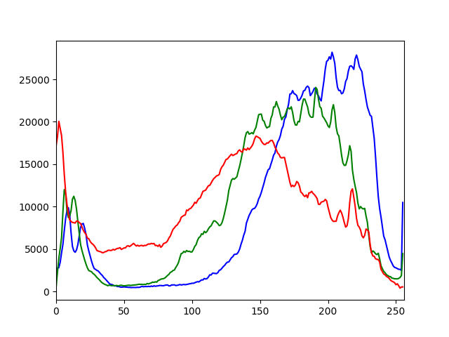
    </div>
</div>

The plots are in the same order as the sample images. As we could have expected from the first plot we can see that all the channels have low intensities corresponding to very dark red, green and blue. We also have to consider that the color black, which is given by $(0, 0, 0)$ in RGB, is abundant in the corresponding image and that may explain why all the channels have peaks in the lower part of the X-axis. Anyway, this can't be much appreciated in this type of visualization given that we're plotting the three channels independently from each other. Later we will see how we can observe the distribution of the combination of the channels' values by using **multi-dimensional histograms**.

From the second plot, we can observe that there's a dark red peak that may correspond to the rocks and the mountains while both the green and the blue channel have a wider range of values. From the last plot, if we exclude the peaks of all the channels in the interval $[0, 30]$, we can observe the opposite of what we saw in the first plot. All the three channels have high intensities and if we consider that $(255, 255, 255)$ in RGB corresponds to white, then by looking at the image it's clear why the histogram has this distribution.

Here are the sample images with the corresponding histograms:

<div class="row justify-content-center mb-3">
    <div class="col-12">
        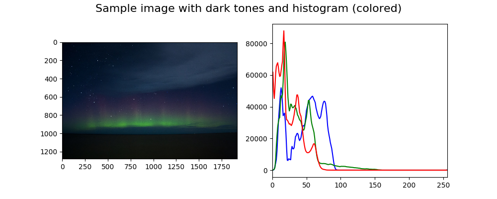
    </div>
</div>

<div class="row justify-content-center mb-3">
    <div class="col-12">
        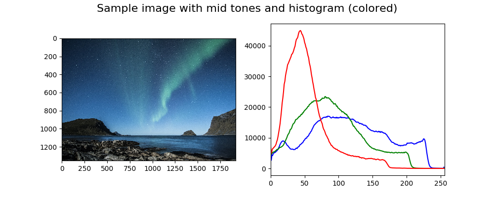
    </div>
</div>

<div class="row justify-content-center mb-3">
    <div class="col-12">
        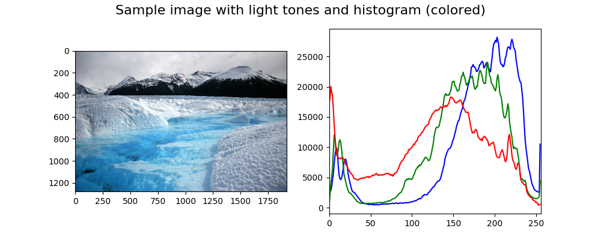
    </div>
</div>

### Multi-dimensional histogram

As anticipated above we're now going to take a look at multi-dimensional histograms.

#### 2D histogram

The idea is that instead of examining each channel separately we analyze them together in groups of 2 (RG, GB, BR) or all together. In the case of 2D histograms, the resulting plot will have the pixel intensities of a channel on the X-axis, the pixel intensities of another channel on the Y-axis, and the frequency is given by the color of the plot. Let's look at an example as it is easier to show it than explaining it.

Here's the code that plots each 2D color histograms one for each pair combinations.

```python
import cv2
from matplotlib import pyplot as plt
from matplotlib import ticker

def show_image_histogram_2d(image, bins=32, tick_spacing=5):
    fig, axes = plt.subplots(1, 3, figsize=(12, 5))
    channels_mapping = {0: 'B', 1: 'G', 2: 'R'}
    for i, channels in enumerate([[0, 1], [0, 2], [1, 2]]):
        hist = cv2.calcHist(
            [image], channels, None, [bins] * 2, [0, 256] * 2)

        channel_x = channels_mapping[channels[0]]
        channel_y = channels_mapping[channels[1]]

        ax = axes[i]
        ax.set_xlim([0, bins - 1])
        ax.set_ylim([0, bins - 1])

        ax.set_xlabel(f'Channel {channel_x}')
        ax.set_ylabel(f'Channel {channel_y}')
        ax.set_title(f'2D Color Histogram for {channel_x} and '
                     f'{channel_y}')

        ax.yaxis.set_major_locator(
            ticker.MultipleLocator(tick_spacing))
        ax.xaxis.set_major_locator(
            ticker.MultipleLocator(tick_spacing))

        im = ax.imshow(hist)

    fig.colorbar(im, ax=axes.ravel().tolist(),
                 orientation='orizontal')
    fig.suptitle(f'2D Color Histograms with {bins} bins',
                 fontsize=16)
    plt.show()
```

Let's now take a look at what this function does. Most of the code is just to have a nicer plot, actually, the logic is really simple. On *line 4* we initialize the figure by configuring 3 subplots all in the same row. Each subplot will contain a 2D histogram. On *line 7* we simply define the mapping between the channel index and the corresponding channel name. Keep in mind that the color space of the images loaded using OpenCV is BGR and not RGB, that's why index `0` correspond to B and not R and so on.

On *line 8* we start to loop over each pair combinations of channels. The first combination is `[0, 1]` which correspond to the pair BG, the second one is `[0, 2]` which correspond to the pair BR, the third one is `[1, 2]` which correspond to the pair GR.

On *line 9* we can see that we call the same function `cv2.calcHist` that we used for 1D histograms. In order to consider 2D histogram the `channels` attribute now contains two values instead of a single one, the `bins` attribute defines how many bins to use for each channel and the value of `ranges` attribute must be repeated (`[0, 256]` becomes `[0, 256, 0, 256]`). The returned value `hist` is a `numpy.ndarray` with shape `(bins, bins)` where `hist[i][j]` is the number of pixels having an intensity value in the range of the $i$-th bin for the channel in the X-axis and in the range of the $j$-th bin for the channel in the Y-axis.

On *lines 12–24* we simply set the axis limits, tick spacing and the labels to show and on *line 26* we draw the plot. After the for-loop on *lines 28–30* we add the horizontal colorbar and we finally show the plot.

Here's the generated plot for the sample image with mid-tones.

<div class="row justify-content-center mb-3">
    <div class="col-12">
        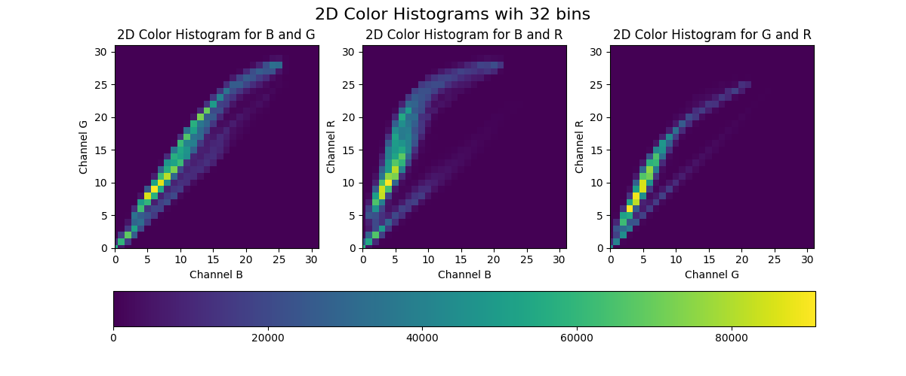
    </div>
</div>

You may have noticed that we used only $32$ bins instead of $256$ as previously. That's because using $256$ bins means having $256 * 256 = 65536$ separate pixel counts which are not very practical and also a waste of resource. Here's the 2D color histogram for the same sample image using $256$ bins.

<div class="row justify-content-center mb-3">
    <div class="col-12">
        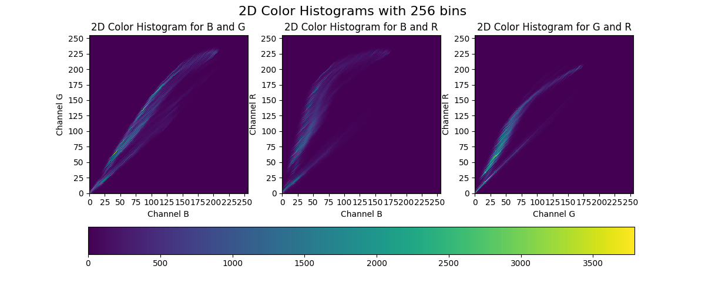
    </div>
</div>

#### 3D histogram

We can easily extend what we've done for the 2D histogram to calculate 3D histogram. Essentially the call to `cv2.calcHist` becomes as follows:

```python
cv2.calcHist([image], [0, 1, 2], None, [bins] * 3, [0, 256] * 3)
```

Even in this case the returned value `hist` is a `numpy.ndarray` with shape `(bins, bins, bins)`. Unfortunately, we cannot easily visualize this histogram.

## Histogram equalization

The **histogram equalization** process is an image processing method to adjust the contrast of an image by modifying the image's histogram. The intuition behind this process is that histograms with large peaks correspond to images with low contrast where the background and the foreground are both dark or both light. Hence histogram equalization stretches the peak across the whole range of values leading to an improvement in the global contrast of an image.

It is usually applied to grayscale images and it tends to produce unrealistic effects, but it is highly used where high contrast is needed such as in medical or satellite images.

OpenCV provides the function `cv2.equalizeHist` to equalize the histogram of an image. The signature is the following:

```python
cv2.equalizeHist(image)
```

where:

1.`image` - is the grayscale image that we want to equalize (we're going to see later how we can extend to a colored image).

This function returns the image with the equalized histogram.

### Theory and derivation of the formula

If you're not interested in the theoretical part, feel free to skip this section and its subsection. We're now going to show which formula is being applied when doing histogram equalization and how to derive it.

Let $n$ be the number of pixels of the given image and $[p_0,p_k]$ the range of the gray levels. Let's also define the histogram of this image as $H(p)$ where $H(p_i)$ is the number of pixels having gray level $p_i$. Our goal is to have a histogram $G(q)$, where $G$ is defined similarly to $H$, which is uniform over all the levels in the range $[q_0,q_k]$. Hence we need to find a monotonic transformation function $q=\mathcal{T}(p)$.

Given that the total sum of bins doesn't change and thanks to the monotonicity we can imply:

$$
\sum_{i_0}^k G(q_i) = \sum_{i_0}^k H(q_i)
$$

Additionally given that $G$ is uniform, we have:

$$
G(q) = \frac{n}{q_k - q_0}
$$

Since the exactly uniform histogram can be obtained only in the continuous space, let's change the first formula as follows:

$$
\begin{aligned}
\int_{q_0}^q G(s) \,ds &= \int_{p_0}^p H(s) \,ds \\
\int_{q_0}^q \frac{n}{q_k - q_0} \,ds &= \int_{p_0}^p H(s) \,ds \\
\frac{n}{q_k - q_0} \int_{q_0}^q \,ds &= \int_{p_0}^p H(s) \,ds \\
\frac{n (q - q_0)}{q_k - q_0} &= \int_{p_0}^p H(s) \,ds \\
q &= \frac{q_k - q_0}{n} \int_{p_0}^p H(s) \,ds + q_0 \\
\end{aligned}
$$

We have found our function $\mathcal{T}$:

$$
q = \mathcal{T} = \frac{q_k - q_0}{n} \int_{p_0}^p H(s) \,ds + q_0
$$

In the discrete space, this corresponds to:

$$
q = \mathcal{T} = \left(\frac{q_k - q_0}{n} \sum_{i=p_0}^p H(i)\right) + q_0
$$

This may seem a complicated formula, but essentially the function $\mathcal{T}$ is simply a lookup table: if in the original histogram the bin count at level $p$ is equal to $v$, then in the equalized histogram that bin is "moved" at level $q$. This mechanism is applied to all levels $p$.

#### Example

Let's see how the histogram equalization works by doing it "by hand" on a very simple fake image. Let our sample grayscale image be defined as follows:

$$
\begin{bmatrix}
0   & 32  & 96  & 64 \\
32  & 32  & 32  & 32 \\
0   & 128 & 0   & 32 \\
128 & 128 & 255 & 64
\end{bmatrix}
$$

We want to equalize the image so that the whole range $[0, 255]$ is used. Hence we have $q_0=0$, $q_k=255$, $p_0=0$, and $n=16$. We can then calculate the following table:

$$
\begin{matrix}
p   & H(p) & \sum_{i=0}^p H(i) & q   \\
    &      &                   &     \\ \hline
    &      &                   &     \\
0   & 3    & 3                 & 48  \\
32  & 6    & 9                 & 143 \\
64  & 2    & 11                & 175 \\
96  & 1    & 12                & 191 \\
128 & 3    & 15                & 239 \\
255 & 1    & 16                & 255
\end{matrix}
$$

where $q$ is simply:

$$
q = \frac{255}{16}\sum_{i=0}^p H(i)
$$

We can now plot both the original and the equalized histogram. We can notice that cumulative equalized histogram is very close to the optimal one.

<div class="row justify-content-center mb-3">
    <div class="col-12">
        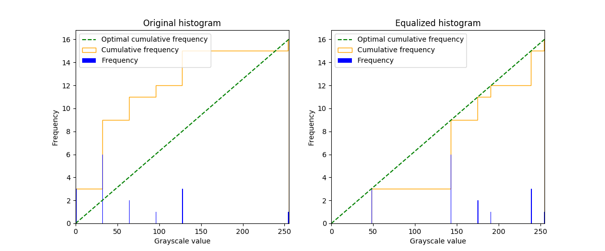
    </div>
</div>

### Histogram equalization for grayscale images

Let's now see how we can easily equalize a grayscale image and show it. Here's the code:

```python
import cv2
from matplotlib import pyplot as plt

def show_grayscale_equalized(image):
    grayscale_image = cv2.cvtColor(image, cv2.COLOR_BGR2GRAY)
    eq_grayscale_image = cv2.equalizeHist(grayscale_image)
    plt.imshow(eq_grayscale_image, cmap='gray')
    plt.show()
```

And here's the comparison between the original grayscale sample image and the equalized one:

<div class="row justify-content-center mb-3">
    <div class="col-12">
        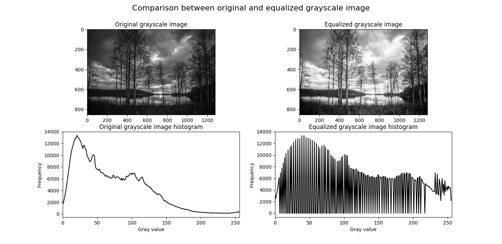
    </div>
</div>

As we can see the global contrast has been improved by the equalization process and the histogram has been stretched.

### Histogram equalization for colored images

It's possible to extend the histogram equalization and apply it to colored images. The most naive approach consists in applying the same process to all the three RGB channels separately and rejoining them together. The problem is that this process changes the relative distributions of the color and may consequently yield to dramatic changes in the image's color balance. Here's the code:

```python
import cv2
from matplotlib import pyplot as plt
def show_rgb_equalized(image):
    channels = cv2.split(image)
    eq_channels = []
    for ch, color in zip(channels, ['B', 'G', 'R']):
        eq_channels.append(cv2.equalizeHist(ch))
    eq_image = cv2.merge(eq_channels)
    eq_image = cv2.cvtColor(eq_image, cv2.COLOR_BGR2RGB)
    plt.imshow(eq_image)
    plt.show()
```

And here's the result of applying the algorithm to a colored sample image:

<div class="row justify-content-center mb-3">
    <div class="col-12">
        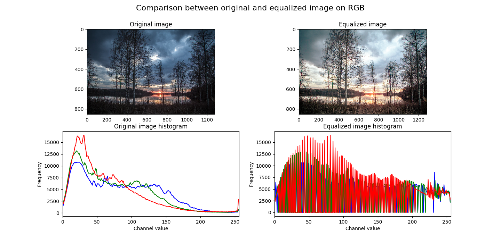
    </div>
</div>

An alternative is to first convert the image to the HSL or HSV color space and then apply the histogram equalization only on the lightness or value channel by leaving the hue and the saturation of the image unchanged. Here's the code that applies the histogram equalization on the value channel of the HSV color space:

```python
import cv2
from matplotlib import pyplot as plt

def show_hsv_equalized(image):
    H, S, V = cv2.split(cv2.cvtColor(image, cv2.COLOR_BGR2HSV))
    eq_V = cv2.equalizeHist(V)
    eq_image = cv2.cvtColor(cv2.merge([H, S, eq_V]),
                            cv2.COLOR_HSV2RGB)
    plt.imshow(eq_image)
    plt.show()
```

And here's the result of applying the algorithm on the same sample image:

<div class="row justify-content-center mb-3">
    <div class="col-12">
        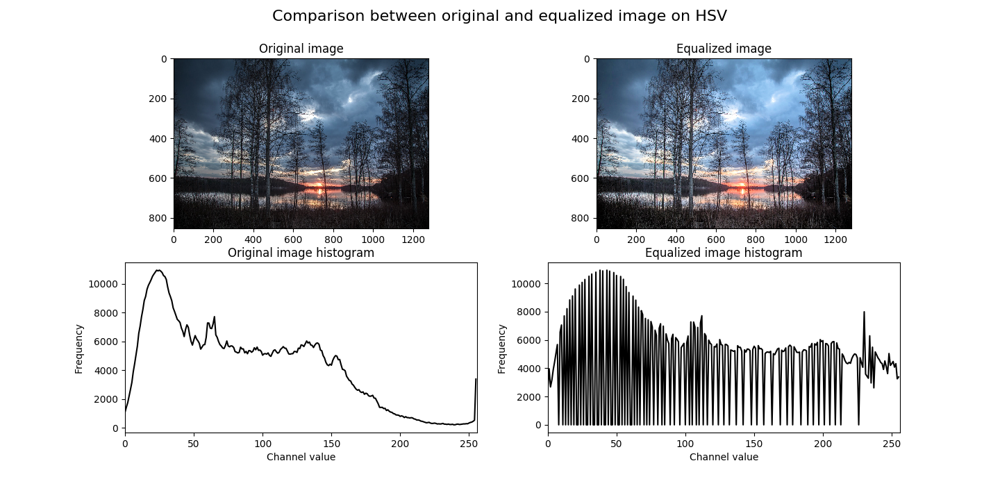
    </div>
</div>

## Conclusions

In this post we saw how to extract and visualize the histogram of an image, both grayscale and colored, and what kind of intuitions we can infer from that. We also discussed how histogram equalization works and how it can be extended to colored images.

There are also other algorithms for histogram equalization that are more robust that haven't been considered here such as AHE (**Adaptive Histogram Equalization**) and CLAHE (**Contrast Limited Adaptive Histogram Equalization**).

Image histograms are simple, but largely used in image processing. One interesting application is the usage of image histograms to build an image search engine based on the similarity between them such explained in this blog post.
